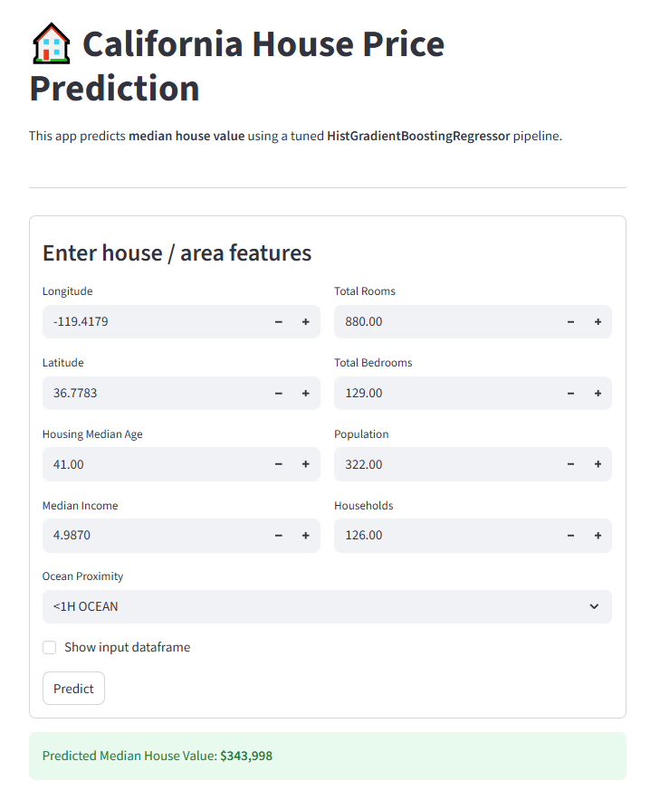

# 🏠 California House Price Predictor

A machine learning project that predicts **median house values in California** using demographic and geographic features.  
The project includes a **trained ML model**, an **interactive Streamlit web app**, and a **reproducible training workflow**.

---

## 🚀 Demo

### Streamlit App (Screenshot)


> The app predicts **median house value** from user-provided geographic and housing features using a tuned **HistGradientBoostingRegressor** pipeline.

---

## 📌 Project Overview
This project is based on the California Housing dataset and demonstrates an **end-to-end ML workflow**:
- Data preprocessing & feature engineering
- Model training and evaluation
- Model serialization
- Interactive deployment with Streamlit

The app allows users to input location and housing statistics and receive a real-time price prediction.

---

## 🧠 Model
- **Algorithm:** HistGradientBoostingRegressor
- **Target:** Median house value
- **Key engineered features:**
  - Rooms per household
  - Bedrooms per household
  - Population per household
- **Input validation:** Real-world California latitude/longitude bounds are enforced to prevent invalid predictions

---

## 📊 Model Training
Model development and experimentation are documented in:
  **notebooks/house_price_predict.ipynb**
The notebook covers: 
- Exploratory Data Analysis (EDA)
- Feature engineering
- Model training
- Evaluation
- Model persistence

---

## 📂 Project Structure

```text
house_price_prediction/
├─ house_price_prediction/
│  ├─ house_prediction.py      # Streamlit application
│  ├─ hgb_final.joblib         # Trained ML model
│  ├─ housing.csv              # Dataset
│  └─ house_price_predict.ipynb
├─ assets/
│  └─ demo.png                 # App screenshot
├─ README.md
├─ requirements.txt
├─ .gitignore
└─ LICENSE
```

## ▶️ Installation and Usage

1️⃣ Clone the repository:
```bash
git clone https://github.com/Toukennn/house_price_prediction.git
cd house_price_prediction
```
2️⃣ Create a virtual environment
```bash
python -m venv venv
source venv/Scripts/activate  # On Windows: venv\Scripts\activate
```
3️⃣ Install dependencies
```bash
pip install -r requirements.txt
```
4️⃣ Run the Streamlit app
```bash
cd house_price_prediction/app
streamlit run house_prediction.py
```
